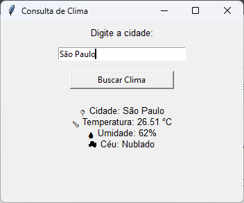

# 🌦️ Captador de Temperatura por Cidade — Python

## 📖 Descrição
Aplicação desenvolvida em **Python** que permite consultar informações climáticas de **qualquer cidade**, utilizando consumo de **API REST**, interface gráfica com **Tkinter** e persistência de dados em **planilha Excel**.

O projeto simula um cenário real de automação, substituindo técnicas frágeis de scraping por uma integração direta com API, garantindo maior confiabilidade e escalabilidade.

---

## 🎯 Objetivo
- Praticar consumo de APIs REST em Python  
- Desenvolver uma interface gráfica simples e funcional  
- Armazenar dados históricos de forma estruturada  
- Aplicar boas práticas de automação e tratamento de erros  

---

## ⚙️ Funcionalidades
- 🔍 Busca de clima por **qualquer cidade**
- 🌡️ Exibição de:
  - Temperatura (°C)
  - Umidade (%)
  - Condição do céu
- 🧠 Validação de entrada do usuário
- 💾 Salvamento automático dos dados em Excel
- 🕒 Registro de data e hora da consulta
- 📊 Criação dinâmica de arquivo e planilha, caso não existam

---

## 🛠️ Tecnologias Utilizadas
- Python 3  
- CustomTkinter  
- Requests  
- OpenWeatherMap API  
- OpenPyXL  
- python-dotenv  

---

## 🚀 Como Executar o Projeto

### 1️⃣ Clone o repositório
```bash
git clone https://github.com/Ingridxisto/Captador-de-Temperatura.git
cd Captador-de-Temperatura
```

### 2️⃣ Crie e ative o ambiente virtual (.venv)

Windows (PowerShell):
```powershell
python -m venv .venv
.\.venv\Scripts\Activate.ps1
```

Windows (CMD):
```cmd
python -m venv .venv
.\.venv\Scripts\activate.bat
```

Linux/Mac (bash/zsh):
```bash
python3 -m venv .venv
source .venv/bin/activate
```

Para desativar:
```bash
deactivate
```

### 3️⃣ Instale as dependências
```bash
pip install -r requirements.txt
```

### 4️⃣ Configure a API Key com .env

Crie um arquivo `.env` na raiz do projeto:
```
API_KEY=SUA_CHAVE_API
```

### 5️⃣ Execute o projeto
```bash
python clima.py
```

---

## 🧩 Arquitetura do Projeto
- Interface gráfica responsável pela interação com o usuário  
- Função dedicada para consumo da API de clima  
- Função separada para persistência de dados  
- Tratamento de erros para cidades inválidas e arquivos inexistentes  

---

## 🖼️ Interface

A aplicação possui uma interface simples e intuitiva, permitindo que o usuário informe a cidade desejada e visualize o clima em tempo real.



---

## 📚 Aprendizados

- Consumo de APIs REST

- Integração entre interface gráfica e backend

- Persistência de dados em Excel

- Tratamento de erros e validações

- Organização e modularização de código

---

## 🔮 Possíveis Melhorias Futuras

- Geração de gráficos de histórico climático

- Integração com banco de dados

- Uso de IA para previsões ou insights

- Internacionalização da aplicação

---

## 👩‍💻 Autora

Ingrid Xisto
Estudante de Análise e Desenvolvimento de Sistemas
Foco em Python, Automação, APIs e Inteligência Artificial

🔗 GitHub: https://github.com/Ingridxisto

🔗 LinkedIn: https://www.linkedin.com/in/ingridxisto/
